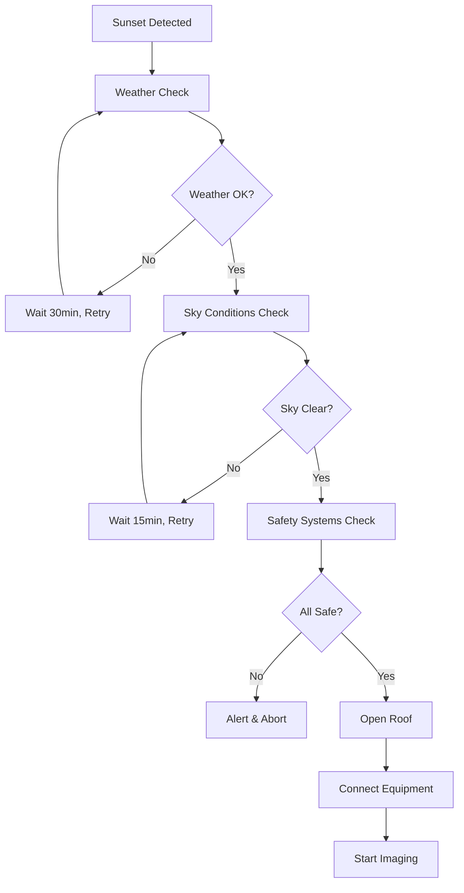
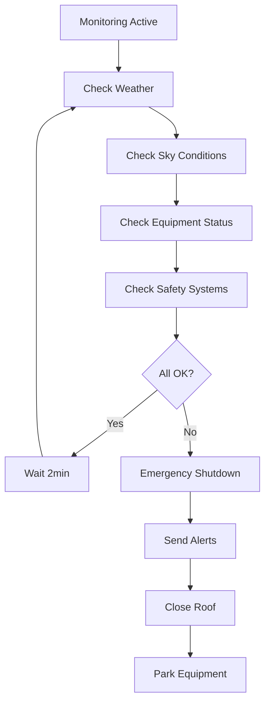
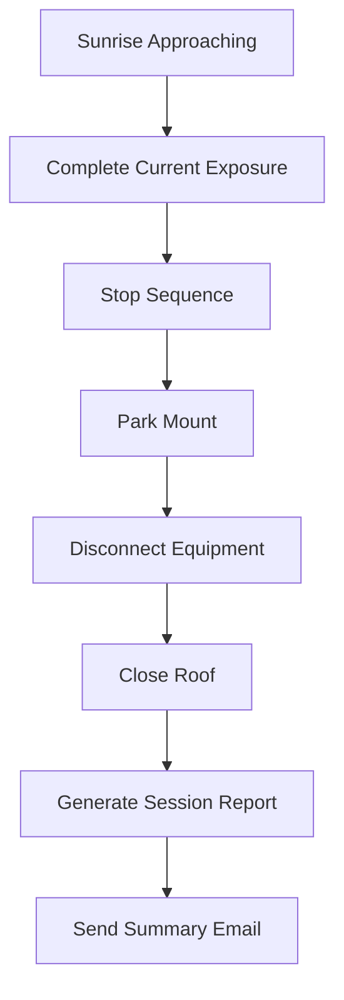

# Observatory Automation Architecture

This document outlines the overall architecture for automating the Hualapai Valley Observatory using the HVOv9 platform.

## System Overview

The HVOv9 observatory automation system coordinates multiple subsystems to enable safe, unattended imaging operations:

```
┌─────────────────┐    ┌─────────────────┐    ┌─────────────────┐
│   Weather       │    │   Sky Monitor   │    │   NINA Client   │
│   Monitoring    │    │   (Cloud/Stars) │    │   (Imaging)     │
└─────────┬───────┘    └─────────┬───────┘    └─────────┬───────┘
          │                      │                      │
          └──────────────────────┼──────────────────────┘
                                 │
                    ┌─────────────┴─────────────┐
                    │    Observatory           │
                    │    Controller            │
                    │    (Central Logic)       │
                    └─────────────┬─────────────┘
                                  │
          ┌───────────────────────┼───────────────────────┐
          │                       │                       │
    ┌─────┴───────┐     ┌─────────┴─────────┐     ┌─────────┴─────────┐
    │   Roof      │     │   Safety         │     │   Web Dashboard   │
    │   Controller│     │   Systems        │     │   (Monitoring)    │
    └─────────────┘     └───────────────────┘     └───────────────────┘
```

## Core Components

### 1. Observatory Controller

Central orchestration service that coordinates all subsystems:

```csharp
public class ObservatoryController
{
    private readonly WeatherService _weather;
    private readonly SkyMonitorService _skyMonitor;
    private readonly RoofController _roofController;
    private readonly NinaApiClient _ninaClient;
    private readonly SafetySystem _safetySystem;
    
    public async Task<Result> StartAutomatedSessionAsync()
    {
        // 1. Pre-flight checks
        var safetyCheck = await _safetySystem.PerformPreFlightCheckAsync();
        if (!safetyCheck.IsSuccess) return safetyCheck;
        
        // 2. Weather assessment
        var weather = await _weather.GetForecastAsync(hours: 4);
        if (!weather.IsSuccess || !weather.Value.IsSafeForImaging)
            return Result.Failure(new Exception("Weather unsuitable for imaging"));
        
        // 3. Sky conditions
        var skyConditions = await _skyMonitor.AssessConditionsAsync();
        if (!skyConditions.IsSuccess || skyConditions.Value.CloudCover > 30)
            return Result.Failure(new Exception("Sky conditions too cloudy"));
        
        // 4. Open roof
        var roofResult = await _roofController.OpenRoofAsync();
        if (!roofResult.IsSuccess) return roofResult;
        
        // 5. Connect NINA equipment
        var ninaResult = await _ninaClient.ConnectAllAsync();
        if (!ninaResult.IsSuccess)
        {
            await _roofController.CloseRoofAsync(); // Rollback
            return ninaResult;
        }
        
        // 6. Start imaging sequence
        return await _ninaClient.StartSequenceAsync();
    }
}
```

### 2. Safety System

Multi-layered safety monitoring with automatic abort capabilities:

```csharp
public class SafetySystem
{
    private readonly Timer _monitorTimer;
    private readonly List<ISafetyMonitor> _monitors;
    
    public SafetySystem(
        WeatherSafetyMonitor weatherMonitor,
        EquipmentSafetyMonitor equipmentMonitor,
        PowerSafetyMonitor powerMonitor)
    {
        _monitors = new() { weatherMonitor, equipmentMonitor, powerMonitor };
        _monitorTimer = new Timer(CheckAllSafetySystems, null, 
            TimeSpan.Zero, TimeSpan.FromMinutes(1));
    }
    
    private async void CheckAllSafetySystems(object? state)
    {
        foreach (var monitor in _monitors)
        {
            var status = await monitor.CheckSafetyAsync();
            if (!status.IsSafe)
            {
                await TriggerEmergencyShutdownAsync(status.Reason);
                break;
            }
        }
    }
    
    private async Task TriggerEmergencyShutdownAsync(string reason)
    {
        _logger.LogCritical("Emergency shutdown triggered: {Reason}", reason);
        
        // Stop all imaging
        await _ninaClient.StopSequenceAsync();
        await _ninaClient.ParkMountAsync();
        
        // Close roof
        await _roofController.CloseRoofAsync();
        
        // Send alerts
        await _alertService.SendEmergencyAlertAsync(reason);
    }
}
```

### 3. Weather Integration

Multi-source weather monitoring with predictive capabilities:

```csharp
public class WeatherService
{
    private readonly List<IWeatherProvider> _providers;
    
    public async Task<Result<WeatherForecast>> GetForecastAsync(int hours = 4)
    {
        // Query multiple weather sources
        var forecasts = await Task.WhenAll(
            _providers.Select(p => p.GetForecastAsync(hours))
        );
        
        // Aggregate and validate
        var validForecasts = forecasts.Where(f => f.IsSuccess).Select(f => f.Value);
        if (!validForecasts.Any())
            return Result<WeatherForecast>.Failure(new Exception("No weather data available"));
        
        // Use most conservative forecast
        var consolidated = ConsolidateForecasts(validForecasts);
        return Result<WeatherForecast>.Success(consolidated);
    }
    
    private WeatherForecast ConsolidateForecasts(IEnumerable<WeatherForecast> forecasts)
    {
        return new WeatherForecast
        {
            CloudCover = forecasts.Max(f => f.CloudCover),     // Worst case
            WindSpeed = forecasts.Max(f => f.WindSpeed),       // Worst case
            Humidity = forecasts.Max(f => f.Humidity),         // Worst case
            Temperature = forecasts.Average(f => f.Temperature), // Average
            IsSafeForImaging = forecasts.All(f => f.IsSafeForImaging) // All must agree
        };
    }
}
```

## Automation Workflows

### 1. Evening Startup Sequence



### 2. Continuous Monitoring Loop



### 3. Morning Shutdown Sequence



## Integration Points

### 1. NINA Integration

```csharp
public class NinaIntegrationService
{
    public async Task<Result> StartScheduledImagingAsync(ImagingTarget target)
    {
        // Slew to target
        var slewResult = await _ninaClient.SlewToTargetAsync(target.RA, target.Dec);
        if (!slewResult.IsSuccess) return slewResult;
        
        // Configure sequence for target
        var sequence = new ImagingSequence
        {
            Target = target.Name,
            Exposures = target.Exposures,
            Filters = target.Filters,
            Dither = target.EnableDithering
        };
        
        // Load and start sequence
        await _ninaClient.LoadSequenceAsync(sequence);
        return await _ninaClient.StartSequenceAsync();
    }
}
```

### 2. Sky Monitor Integration

```csharp
public class SkyConditionsMonitor
{
    public async Task<Result<SkyAssessment>> AssessImagingConditionsAsync()
    {
        // Capture current sky image
        var image = await _skyMonitor.CaptureImageAsync();
        if (!image.IsSuccess) return Result<SkyAssessment>.Failure(image.Error);
        
        // Analyze conditions
        var analysis = await _imageAnalyzer.AnalyzeSkyAsync(image.Value);
        
        return Result<SkyAssessment>.Success(new SkyAssessment
        {
            CloudCover = analysis.CloudCoverPercentage,
            StarCount = analysis.DetectedStars.Count,
            SkyBrightness = analysis.MeanPixelValue,
            Recommendation = DetermineRecommendation(analysis)
        });
    }
    
    private ImagingRecommendation DetermineRecommendation(SkyAnalysis analysis)
    {
        if (analysis.CloudCoverPercentage > 50)
            return ImagingRecommendation.Abort;
        
        if (analysis.CloudCoverPercentage > 20)
            return ImagingRecommendation.Caution;
        
        return ImagingRecommendation.Proceed;
    }
}
```

## Configuration Management

### Automation Settings

```json
{
  "Observatory": {
    "Location": {
      "Latitude": 35.0123,
      "Longitude": -113.9876,
      "Elevation": 1200
    },
    "SafetyLimits": {
      "MaxWindSpeed": 25.0,
      "MaxCloudCover": 30.0,
      "MaxHumidity": 85.0,
      "MinTemperature": -10.0,
      "MaxTemperature": 40.0
    },
    "Automation": {
      "EnableAutoStart": true,
      "EnableAutoShutdown": true,
      "WeatherCheckInterval": "00:02:00",
      "SkyCheckInterval": "00:05:00",
      "SafetyCheckInterval": "00:01:00"
    }
  }
}
```

### Target Management

```json
{
  "ImagingTargets": [
    {
      "Name": "M31 - Andromeda Galaxy",
      "RA": "00h42m44s",
      "Dec": "+41°16'09\"",
      "Priority": 1,
      "MinAltitude": 30.0,
      "Exposures": [
        { "Filter": "Luminance", "Duration": 300, "Count": 20 },
        { "Filter": "Red", "Duration": 300, "Count": 10 },
        { "Filter": "Green", "Duration": 300, "Count": 10 },
        { "Filter": "Blue", "Duration": 300, "Count": 10 }
      ],
      "EnableDithering": true,
      "Season": "Autumn"
    }
  ]
}
```

## Monitoring and Alerting

### Real-Time Dashboard

The web dashboard provides real-time monitoring of all systems:

- **Weather conditions** with trend graphs
- **Sky camera** live view and cloud detection
- **Equipment status** (roof, mount, camera)
- **Current imaging target** and progress
- **Safety system status** with alert indicators

### Alert System

Multi-channel alerting for different severity levels:

```csharp
public class AlertService
{
    public async Task SendAlertAsync(AlertLevel level, string message)
    {
        switch (level)
        {
            case AlertLevel.Info:
                await _logger.LogInformationAsync(message);
                break;
                
            case AlertLevel.Warning:
                await _logger.LogWarningAsync(message);
                await _emailService.SendWarningAsync(message);
                break;
                
            case AlertLevel.Critical:
                await _logger.LogCriticalAsync(message);
                await _emailService.SendCriticalAlertAsync(message);
                await _smsService.SendEmergencyTextAsync(message);
                break;
        }
    }
}
```

## Disaster Recovery

### System Recovery Procedures

1. **Power outage recovery**: Automatic restart sequence when power restored
2. **Network connectivity loss**: Local operation mode with cached data
3. **Equipment failure**: Graceful degradation and safe parking
4. **Software crash**: Automatic service restart with state recovery

### Data Backup

- **Image data**: Automatic transfer to cloud storage
- **Configuration**: Version-controlled in Git
- **Logs**: Centralized logging with retention policies
- **Database**: Nightly backups with off-site storage

## Performance Optimization

### Resource Management

```csharp
public class ResourceManager
{
    private readonly SemaphoreSlim _imagingSemaphore = new(1, 1);
    private readonly SemaphoreSlim _roofSemaphore = new(1, 1);
    
    public async Task ExecuteImagingOperationAsync(Func<Task> operation)
    {
        await _imagingSemaphore.WaitAsync();
        try
        {
            await operation();
        }
        finally
        {
            _imagingSemaphore.Release();
        }
    }
}
```

### Caching Strategy

- **Weather data**: Cache for 5 minutes, refresh every 2 minutes
- **Sky conditions**: Cache for 2 minutes, refresh every minute
- **Equipment status**: Cache for 30 seconds, refresh every 15 seconds

## Security Considerations

### Network Security

- **VPN access** for remote monitoring
- **Firewall rules** restricting external access
- **Certificate-based authentication** for API access
- **Encrypted communications** for all external connections

### Access Control

```csharp
[Authorize(Roles = "ObservatoryOperator")]
public class ObservatoryController : ControllerBase
{
    [HttpPost("emergency-stop")]
    public async Task<IActionResult> EmergencyStop()
    {
        await _observatoryService.EmergencyShutdownAsync();
        return Ok();
    }
}
```

## Future Enhancements

### Planned Features

- [ ] **AI-powered weather prediction** using historical data
- [ ] **Automated target selection** based on conditions and priorities
- [ ] **Predictive maintenance** using equipment telemetry
- [ ] **Multi-site coordination** for distributed observatory network
- [ ] **Mobile app** for remote monitoring and control
- [ ] **Integration with popular planetarium software**

### Scalability Considerations

- **Microservices architecture** for better isolation and scaling
- **Message queuing** for reliable inter-service communication
- **Container deployment** for easier management and updates
- **Load balancing** for high-availability configurations

## Related Documentation

- [Weather Service Integration](../projects/weather/README.md)
- [Sky Monitor V5 Architecture](../projects/sky-monitor-v5/README.md)
- [NINA Client Integration](../projects/nina-client/README.md)
- [Roof Controller V4 Design](../projects/roof-controller-v4/README.md)