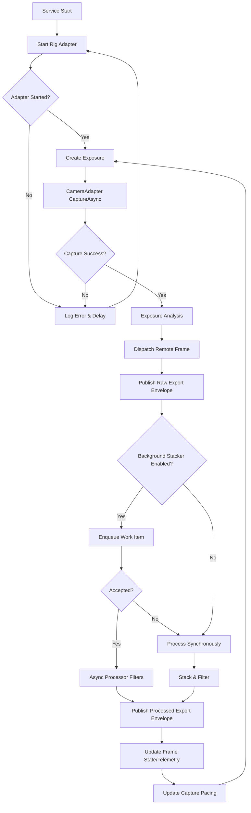
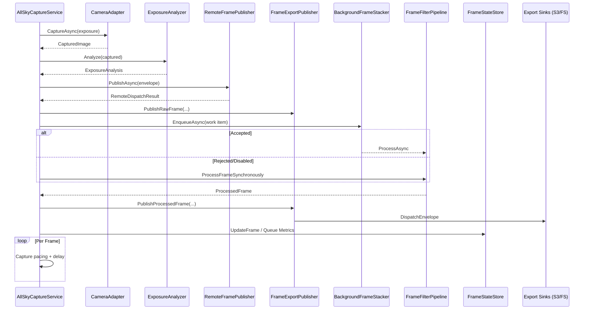

# SkyMonitor V5 Frame Export Project Plan

_Last updated: 2025-10-14_

> **Status:** Project delivery is complete. Remaining polish items have been moved into `docs/TODO.md` for future follow-up.

## Purpose

Deliver a unified export pipeline that reliably publishes both raw and processed frames to configured sinks (S3, filesystem, future transports) without blocking the capture or processing loops. Every frame must carry a stable identifier so downstream systems can correlate raw, processed, and fan-out events. Telemetry and operational tooling should surface export health and make retries or analysis straightforward.

> **Identifier Strategy:** .NET 9 supports time-ordered GUIDs via `Guid.CreateVersion7()`. Each frame will receive a Version 7 GUID when first captured. The ID flows through raw dispatch, processing, and all export sinks. Sidecar JSON manifests and telemetry rows will use the same identifier so consumers can join data across stages.

## Capture-to-Export Flow

1. **AllSkyCaptureService Startup** – `ExecuteAsync` resolves the active rig, subscribes to options, and opens the capture loop. External dependency: rig adapter drivers (`IRigAcquisitionAdapter`).
2. **Exposure Preparation** – `IExposureController.CreateNextExposure` negotiates camera settings using latest analysis, prior frames, and configuration updates from `IFrameStateStore`.
3. **Frame Acquisition** – `CameraAdapterBase.CaptureAsync` runs the adapter pipeline (`ConfigureExposureAsync` → `AcquireImageAsync` → `Preprocess` → `Postprocess` → `CreateFrameContextAsync` → `CreateCapturedImageAsync`). External dependencies vary by adapter (hardware SDKs, star-field engines, calibration assets).
4. **Analysis & Telemetry** – Optional `IExposureAnalyzer` computes luminance metrics and feeds them back to the controller and state store so future exposures adapt automatically.
5. **Remote Dispatch** – `DispatchRemoteAsync` wraps the frame in a `RemoteFrameEnvelope` and calls `_remoteFramePublisher.PublishAsync`, which may fan out over WebSockets, HTTP, or MQTT depending on configuration (external consumers: mobile dashboards, downstream automation).
6. **Export Publishing** – `_frameExportPublisher.PublishRawFrame` immediately emits a `FrameExportEnvelope` (Stage: Raw) onto the export dispatcher channel for sinks such as S3 (`S3FrameExportSink`) or the filesystem sink.
7. **Processing Path Selection** – `ProcessCapturedFrameAsync` either enqueues to `_backgroundFrameStacker` (async path) or processes inline via `_frameStacker` and `_frameFilterPipeline` (sync path).
8. **Processed Export & State Update** – Once filters complete, `_frameExportPublisher.PublishProcessedFrame` emits the processed export envelope, and `_frameStateStore.UpdateFrame` stores raw/processed snapshots plus queue metrics for diagnostics.
9. **Loop Instrumentation** – Capture pacing (`ApplyCapturePacing`), queue telemetry, and retry penalties are updated before the loop delays and repeats.

### Flowchart

### Sequence Diagram

### External Integrations

- **Rig/Camera SDKs** – Concrete adapters (e.g., ZWO ASI) depend on vendor libraries for hardware capture.
- **Remote Dispatch Consumers** – Configurable remote publishers can stream frames to mobile dashboards or automation services via WebSocket, gRPC, or HTTP.
- **Export Sinks** – Current sinks forward envelopes to S3 (MinIO/AWS) and local filesystem targets. Future sinks may include NINA bridge or observatory archives.
- **Telemetry Store** – Export attempts, queue metrics, and capture pacing data persist to the SkyMonitor telemetry database for diagnostics UI consumption.

### Downloadable Diagrams

- SVG architecture view: `docs/projects/sky-monitor-v5/diagrams/capture-export-architecture.svg`
- PDF summary: `docs/projects/sky-monitor-v5/diagrams/capture-export-architecture.pdf`

## Phase Breakdown

### Phase 1 – Export Infrastructure

- [x] Define `FrameExportStage` enum (e.g., `Raw`, `Processed`, future `Derived`).
- [x] Create `FrameExportEnvelope` struct/class carrying `Guid FrameId`, `FrameExportStage`, payload bytes/streams, and `FrameExportMetadata` (timestamp, exposure, rig/camera, filter, queue metrics, etc.).
- [x] Implement bounded channel (`Channel<FrameExportEnvelope>`) and `FrameExportDispatcher` background service that dequeues envelopes and invokes registered sinks asynchronously.
- [x] Register dispatcher in DI with configurable capacity, drop/backpressure policy, and concurrency settings.
- [x] Introduce `IFrameExportSink` interface returning `Result`/`Result<T>` with stage subscription capability.
- [x] Wire capture pipeline and post-processing pipeline to enqueue envelopes (raw and processed respectively) without blocking.

### Phase 2 – S3 & Filesystem Sinks

- [x] Implement `S3FrameExportSink` with per-stage configuration (bucket, prefix, credentials via existing MinIO factory).
- [x] Serialize metadata to S3 object metadata (ASCII-safe subset) and produce sidecar JSON (`{frameId}.json`).
- [x] Adopt Polly (or existing resilience helpers) for retry/backoff on transient S3 failures.
- [x] Implement `FilesystemFrameExportSink` mirroring directory structure, writing image + JSON manifests atomically.
- [x] Introduce configuration model (`FrameExportOptions`) persisted via configuration store with per-stage sink lists, credentials, common defaults (channel capacity, image format hints).
- [x] Extend admin configuration bootstrap to load/export options; add initial seeds enabled for dev S3 (filesystem + MinIO defaults provided, credentials via user secrets) and disabled for prod by default.

### Phase 3 – Telemetry, Diagnostics, and Retry Support

- [x] Extend telemetry database with frame export attempt tables capturing frame ID, stage, sink, outcome, latency, payload size.
- [x] Add exporter instrumentation (structured logs, metrics: success/failure counters, latency histograms, channel depth gauges).
- [x] Surface telemetry via diagnostics endpoint/API so dashboards can show export status & retry backlog.
	- `/api/v1.0/diagnostics/frame-exports` and `/history` now return aggregated metrics + recent attempt samples.
	- Blazor diagnostics page renders sink summaries, latency charts, and recent attempt timeline (export + queue + processing metrics).
- [x] Add optional retry queue for failed exports (persist failed envelopes + metadata, attempt replay with exponential backoff).
- [x] Author integration tests simulating transient S3 failures, verifying retries and telemetry persistence.

### Phase 4 – Configuration & UI Enablement

- [ ] _(Backlog – see docs/TODO.md)_ Expose `FrameExportOptions` in admin configuration UI (enable/disable sinks, edit prefixes, toggle sidecar JSON).
- [x] Surface export metrics and last-success timestamps in diagnostics view (tie into existing telemetry cards).
- [ ] _(Backlog – see docs/TODO.md)_ Provide CLI or tooling scripts (`scripts/export-frame-diagnostics.sh`, etc.) to inspect latest exports and trigger manual replays.
- [ ] _(Backlog – see docs/TODO.md)_ Document operational playbook for exports (S3 prefixes, file retention, troubleshooting steps).

### Phase 5 – Cleanup & Release

- [ ] _(Backlog – see docs/TODO.md)_ Audit for TODO/FIXME in exporter code, ensure Result<T> pattern and logging levels align with workspace standards.
- [ ] _(Backlog – see docs/TODO.md)_ Verify channel capacity and backpressure settings with stress harness; adjust defaults and document tuning guidance.
- [x] Finalize markdown docs (update `docs/TODO.md`, deployment runbooks, README references).
- [ ] _(Backlog – see docs/TODO.md)_ Tag release milestone (`frame-export-complete`, etc.) as project complete.
- [ ] _(Backlog – see docs/TODO.md)_ Conduct final review with ops/support; capture feedback in Notes section below.

## Configuration & Secrets

- **Filesystem sink** (per stage)
	- `Enabled`: toggles the sink; when true and a root path is supplied, the dispatcher writes payload + manifest to disk.
	- `RootPath`: base directory; default dev value (`/workspaces/HVOv9/artifacts/exports/<stage>`) keeps exports inside the repo.
	- `Prefix`: optional relative segments that appear between the root and the stage folder; we trim redundant separators and skip re-appending the stage if it already ends the prefix.
	- `IncludeMetadataManifest`: controls whether a JSON sidecar (`{baseName}.json`) is written alongside the payload file.
	- **Output layout**: `<RootPath>/<Prefix?>/<Stage>/<yyyy>/<MM>/<dd>/<HHmmssfff>-<frameId>.<ext>`.
		- Stage directory is the lower-case name (`raw`, `processed`).
		- Filenames use the frame’s StageTimestamp in UTC plus the deterministic GUID (Version 7).

- **S3 sink** (per stage)
	- `Enabled`: enables uploads when both bucket and credentials are valid.
	- `Bucket`: target S3/MinIO bucket; sink now auto-creates it on first use with per-endpoint concurrency guards.
	- `Prefix`: optional virtual folder path; trimmed and deduplicated against the stage segment.
	- `Endpoint`, `UseSsl`: passed to `MinioClientProvider` for connection; scheme-less endpoints (e.g., `192.168.2.104:9000`) work with `UseSsl:false` in dev.
	- `AccessKey` / `SecretKey`: credentials retrieved via user secrets/env vars (see `scripts/setup-user-secrets.sh`).
	- `EmitMetadataHeaders`: emits key metadata into object headers when true (useful for search/analytics).
	- `EmitJsonManifest`: writes `{baseName}.json` alongside the payload object.
	- **Key layout**: `<Prefix?>/<Stage>/<yyyy>/<MM>/<dd>/<HHmmssfff>-<frameId>.<ext>` with deduplicated stage segment.

- **Bucket provisioning & resilience**
	- `S3FrameExportSink` checks existence under a `ConcurrentDictionary` guard and calls `MakeBucketAsync` if needed; in race conditions it retries an existence check before surfacing exceptions.
	- All uploads run through `IFrameExportResiliencePolicyProvider`, so timeouts/retries can be tuned centrally (Polly policy).
	- Tests: unit tests mock `BucketExistsAsync`, and `MinioDev` integration test (gated via runsettings) verifies create → upload → cleanup cycle against the dev MinIO profile.

- **Channel & dispatcher behavior**
	- `FrameExportOptions` normalization skips invalid sinks and only activates those with complete credentials/paths.
	- `FrameExportDispatcher` fan-outs to active sinks concurrently but reports aggregate success/failure per envelope.
	- Raw and processed pipeline stages share the same configuration schema, so new sinks inherit the same option set when added.

- Development S3 credentials (available via existing secret provisioning) will drive Phase 2 testing.
- Add new secrets/option keys to `docs/TODO.md` and `scripts/setup-user-secrets.sh` if extra env vars are required for exporters.
- Provide `HVO_SECRET__SKYMONITORV5__FRAMEEXPORT_RAW_S3_ACCESSKEY` and `HVO_SECRET__SKYMONITORV5__FRAMEEXPORT_RAW_S3_SECRETKEY` environment variables (the setup script maps them into user secrets for the raw S3 sink credentials).
- Ensure filesystem sink default root respects container deployments (`/var/hvo/exports/frames`) and dev hosts (`artifacts/exports`).
- Ensure the Docker setup is update for any deployment scripts and files.

## Notes / Follow-Ups

- Export publisher currently encodes raw frames as PNG eager snapshots; revisit once sinks can stream or reuse existing buffers.
- Need concrete sink implementations and telemetry wiring in Phases 2/3 before enabling exports in production configs.
- Diagnostics includes telemetry visualizations; add retry backlog indicators once retry channel is implemented.
- Retry queue service is active (options, persistence, metrics); retry integration tests cover transient failure replay (`FrameExportRetryServiceTests`).
- S3 exports now apply configurable Polly timeout/retry policy via `FrameExportResiliencePolicyProvider`.
- MinIO client (`mc`) installed manually inside the dev container for verification; promote into the devcontainer toolchain in a follow-up.
- MinIO bucket provisioning integration test is tagged with a `MinioDev` category; run via `dotnet test --settings src/HVO.SkyMonitorV5.RPi.Tests/minio-dev.runsettings` when validating against the dev MinIO profile.
