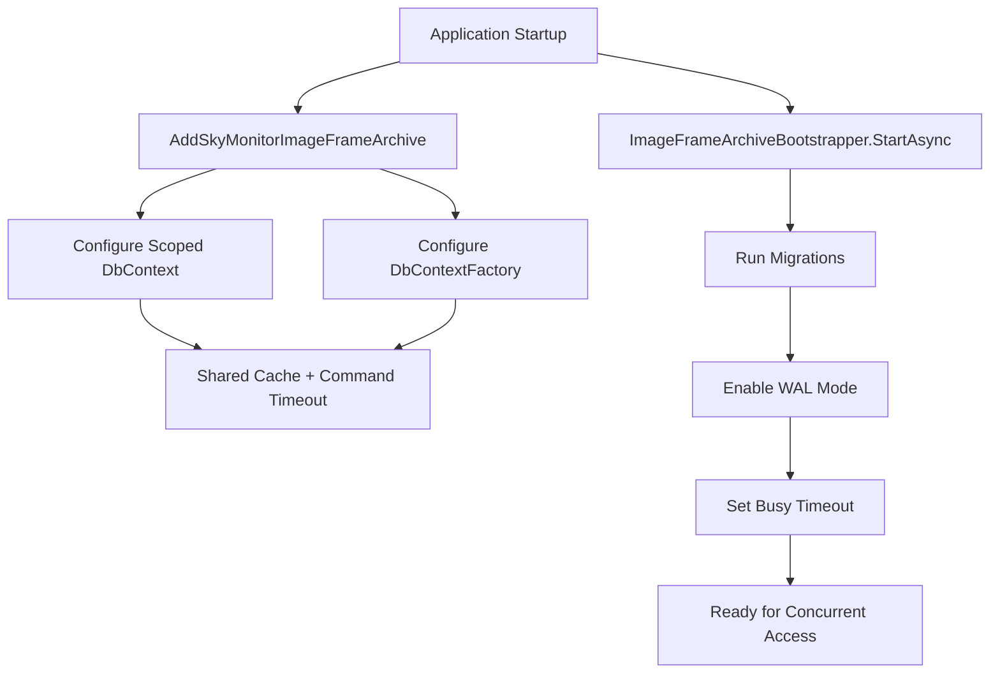

# SQLite Concurrency Configuration

> **Document Status**: Technical reference for SQLite database concurrency settings  
> **Last Updated**: 2025-10-26  
> **Related**: `ImageFrameArchiveContext`, `SkyMonitorDataServiceCollectionExtensions`, `ImageFrameArchiveBootstrapper`

---

## Overview

SQLite has inherent limitations with concurrent write access. When multiple threads or processes attempt to write to the same SQLite database simultaneously, one of the following can occur:

1. **Database is locked** errors (SQLite Error 5)
2. **Database is busy** errors  
3. Write operations failing or timing out

The HVOv9 SkyMonitor V5 application mitigates these issues through a combination of:
- **WAL (Write-Ahead Logging) mode**
- **Shared cache mode**
- **Busy timeout configuration**
- **Connection pooling**

## Problem Scenario

**Symptom:**
```
Microsoft.Data.Sqlite.SqliteException (0x80004005): SQLite Error 5: 'database is locked'
```

**Common Causes:**
1. Multiple concurrent writes to image_frame_archive.sqlite
2. Long-running read transactions blocking writes
3. Default journal mode (DELETE) not optimized for concurrency
4. Insufficient busy timeout

## Solution Components

### 1. WAL (Write-Ahead Logging) Mode

**What it does:**
- Separates write operations into a separate WAL file
- Allows readers and writers to operate concurrently
- Significantly improves concurrent access performance

**Configuration:**
```sql
PRAGMA journal_mode=WAL;
```

**Applied in:** `ImageFrameArchiveBootstrapper.StartAsync()`

**Benefits:**
- Readers don't block writers
- Writers don't block readers
- Better performance for write-heavy workloads
- Atomic commit of multiple write operations

**Trade-offs:**
- Requires additional disk space for WAL and SHM files
- Checkpoint operations needed periodically (automatic)
- Not suitable for network file systems (not an issue for local storage)

### 2. Busy Timeout

**What it does:**
- Configures how long a connection waits for locks to be released
- Prevents immediate failure when database is locked

**Configuration:**
```sql
PRAGMA busy_timeout=5000;  -- 5 seconds
```

**Applied in:** `ImageFrameArchiveBootstrapper.StartAsync()`

**Benefits:**
- Automatic retry logic for lock conflicts
- Reduces transient "database is locked" errors
- Configurable wait time based on workload

### 3. Shared Cache Mode

**What it does:**
- Enables cache sharing between connections in the same process
- Improves memory efficiency and reduces disk I/O

**Configuration:**
```csharp
var connectionString = new SqliteConnectionStringBuilder
{
    DataSource = databasePath,
    Mode = openMode,
    Cache = SqliteCacheMode.Shared
}.ToString();
```

**Applied in:** `SkyMonitorDataServiceCollectionExtensions` (both DbContext and DbContextFactory registrations)

**Benefits:**
- Reduced memory footprint
- Faster page access from shared cache
- Better coordination between connections

### 4. Command Timeout

**What it does:**
- Sets maximum execution time for database commands
- Prevents indefinite blocking on slow operations

**Configuration:**
```csharp
sqliteOptions.CommandTimeout(30);  // 30 seconds
```

**Applied in:** `SkyMonitorDataServiceCollectionExtensions`

**Benefits:**
- Prevents indefinite hangs
- Provides clear timeout errors
- Allows application to recover from stuck operations

## Implementation Details

### File Locations

1. **Bootstrap Configuration:** `HostedServices/ImageFrameArchiveBootstrapper.cs`
   - Enables WAL mode on startup
   - Sets busy timeout
   - Runs once during application initialization

2. **Connection Configuration:** `HVO.SkyMonitorV5.Data/Extensions/SkyMonitorDataServiceCollectionExtensions.cs`
   - Configures shared cache mode
   - Sets command timeout
   - Applies to all connections (scoped and factory)

3. **Registration:** `Program.cs`
   - Calls `AddSkyMonitorImageFrameArchive()` with configuration callbacks
   - Registers ImageFrameArchiveBootstrapper as hosted service

### Code Flow



## Monitoring and Troubleshooting

### Verifying WAL Mode

Check if WAL mode is enabled:

```bash
sqlite3 /path/to/image_frame_archive.sqlite "PRAGMA journal_mode;"
```

Expected output: `wal`

### Checking WAL File Size

```bash
ls -lh /path/to/image_frame_archive.sqlite*
```

You should see three files:
- `image_frame_archive.sqlite` - Main database
- `image_frame_archive.sqlite-wal` - Write-ahead log
- `image_frame_archive.sqlite-shm` - Shared memory index

### Checkpoint Status

Check WAL checkpoint status:

```bash
sqlite3 /path/to/image_frame_archive.sqlite "PRAGMA wal_checkpoint(FULL);"
```

### Performance Metrics

Monitor concurrency performance:

```bash
# Check for lock waits in logs
grep "database is locked" /path/to/logs/skymonitor-*.log

# Check WAL file growth
watch -n 5 'ls -lh /path/to/image_frame_archive.sqlite-wal'
```

## Best Practices

### Do's ✅

1. **Keep transactions short**: Minimize time between BEGIN and COMMIT
2. **Use async patterns**: Leverage `await` for I/O-bound operations
3. **Dispose contexts promptly**: Use `await using` or `using` statements
4. **Batch writes when possible**: Group multiple inserts into single transaction
5. **Use NoTracking for reads**: Factory contexts default to this already

### Don'ts ❌

1. **Don't hold long-running read transactions**: They block checkpoints
2. **Don't perform heavy CPU work inside transactions**: Keep transactions I/O-only
3. **Don't nest contexts unnecessarily**: Use factory pattern for concurrent scenarios
4. **Don't disable WAL mode**: Required for concurrent access
5. **Don't ignore timeout errors**: They indicate genuine contention issues

## Concurrency Limits

**SQLite Theoretical Limits:**
- **Writers**: 1 at a time (serialized via locks)
- **Readers**: Unlimited concurrent readers (with WAL)
- **Reader+Writer**: Yes, readers can proceed while writer is active (with WAL)

**Practical Limits (HVOv9):**
- **Archive ingestion**: 1-2 concurrent writes (ImageFrameArchiveIngestionService)
- **API reads**: 5-10 concurrent reads (via IDbContextFactory)
- **UI navigation**: 3-5 concurrent reads (frame detail, history list)

## Scaling Considerations

### When SQLite is Sufficient

- Single-server deployment
- Write rate < 1000 transactions/second
- Read rate < 10,000 queries/second
- Total database size < 100GB

### When to Consider PostgreSQL/SQL Server

- Multi-server deployment required
- Write rate > 1000 transactions/second
- Need for advanced query optimization
- Require stored procedures or complex triggers
- Team expertise with relational databases

## Testing Concurrent Access

### Manual Stress Test

```bash
# Terminal 1: Continuous writes
for i in {1..1000}; do
  sqlite3 /path/to/image_frame_archive.sqlite \
    "INSERT INTO processed_frame_archive (frame_id, ...) VALUES (...);"
done

# Terminal 2: Continuous reads
for i in {1..1000}; do
  sqlite3 /path/to/image_frame_archive.sqlite \
    "SELECT COUNT(*) FROM processed_frame_archive;"
done
```

### Using Stress Harness

The `HVO.SkyMonitorV5.RPi.Stress` project includes scenarios that stress the archive:

```bash
cd /workspaces/HVOv9/src/HVO.SkyMonitorV5/HVO.SkyMonitorV5.RPi.Stress
dotnet run -- --duration 60 --samples 30
```

Monitor for "database is locked" errors during the run.

## Configuration Reference

### Current Settings (Development)

| Setting | Value | Applied In |
|---------|-------|------------|
| Journal Mode | WAL | ImageFrameArchiveBootstrapper |
| Busy Timeout | 5000ms | ImageFrameArchiveBootstrapper |
| Cache Mode | Shared | Connection string |
| Command Timeout | 30s | EF Core configuration |
| Connection Pooling | Enabled | EF Core default |

### Production Recommendations

| Setting | Development | Production |
|---------|-------------|------------|
| Journal Mode | WAL | WAL |
| Busy Timeout | 5000ms | 10000ms (10s) |
| Cache Mode | Shared | Shared |
| Command Timeout | 30s | 60s |
| WAL Auto-checkpoint | 1000 pages | 10000 pages |

To adjust WAL checkpoint threshold:

```sql
PRAGMA wal_autocheckpoint=10000;
```

## Related Documentation

- [SQLite WAL Mode](https://www.sqlite.org/wal.html)
- [SQLite Locking](https://www.sqlite.org/lockingv3.html)
- [SQLite Shared Cache](https://www.sqlite.org/sharedcache.html)
- [EF Core SQLite Provider](https://learn.microsoft.com/en-us/ef/core/providers/sqlite/)
- [Frame Export Path Structure](frame-export-path-structure.md)
- [Operations Runbook](skymonitor-v5-operations-runbook.md)

## Changelog

### 2025-10-26
- Initial documentation
- Implemented WAL mode enablement in ImageFrameArchiveBootstrapper
- Added shared cache and command timeout configuration
- Configured busy timeout (5 seconds)

