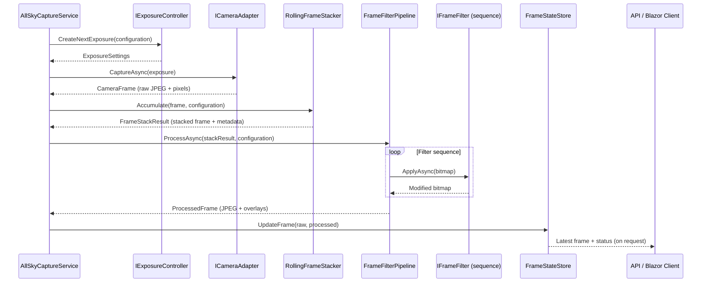
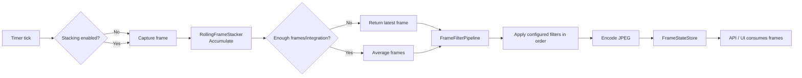

# HVO SkyMonitor v5 Raspberry Pi Host

HVO SkyMonitor v5 is the Raspberry Pi service that captures synthetic or hardware camera frames, performs rolling integration/stacking, and projects annotated all-sky imagery for the Hualapai Valley Observatory. The service ships with a modular processing pipeline that lets you arrange post-processing filters per camera without touching code.

## System overview

- **Capture loop** – `AllSkyCaptureService` orchestrates exposures, capture, stacking, filtering, and persistence.
- **Camera adapters** – Implement `ICameraAdapter` to talk to real hardware or simulations (for development we ship the `MockFisheyeCameraAdapter`).
- **Exposure controller** – `IExposureController` chooses day/night integration settings.
- **Stacking engine** – `RollingFrameStacker` buffers frames and averages them once enough light has accumulated.
- **Filter pipeline** – `FrameFilterPipeline` can execute a configured sequence of `IFrameFilter` instances (overlays are disabled by default so frames mirror the raw starfield output).
- **State store** – `FrameStateStore` keeps track of the latest raw/processed frames and active configuration for API and UI consumers.

## Frame processing filters

> Filters are optional and not registered in the default deployment. Enable them if you need annotations or masks layered onto the synthetic starfield.

| Filter | Name (for configuration) | Purpose |
| ------ | ------------------------ | ------- |
| Cardinal directions | `CardinalDirections` | Draws a dashed azimuth ring with north/east/south/west tick marks and labels, helping viewers orient the dome.
| Celestial annotations | `CelestialAnnotations` | Projects configurable star, planet, and deep-sky object labels in their sidereal-corrected positions with color-coded markers.
| Overlay text | `OverlayText` | Displays observatory coordinates, localised timestamp, exposure, gain, and rolling integration summary in the lower-left corner of the frame.
| Circular mask | `CircularMask` | Darkens the corners outside a 95% diameter circle to mimic traditional all-sky fisheye vignetting or privacy masks.

Each filter implements `IFrameFilter`, receives the `SKBitmap` for the current frame, and may decide whether to run based on the live `CameraConfiguration` (for example, both overlay filters respect `EnableImageOverlays`, and the mask filter checks `EnableMaskOverlay`).

## Rolling stacking buffer

`RollingFrameStacker` manages a queue of captured frames to smooth noise and improve low-light performance:

- **Capture enqueue** – Every frame is stored with its raw pixel buffer (decoded if a compressed source was supplied) and exposure duration added to the cumulative integration window.
- **Minimum depth** – The buffer keeps at least `StackingBufferMinimumFrames` frames.
- **Integration budget** – Trimming never drops below `StackingBufferIntegrationSeconds` (converted to milliseconds).
- **Stack trigger** – Once the queue holds `StackingFrameCount` frames, the newest `StackingFrameCount` frames are averaged pixel-wise (`RollingFrameStacker.AverageFrames`).
- **Fallbacks** – If buffers mismatch in size or decoding fails, the most recent frame is returned without stacking so the feed keeps flowing.

The effective integration time reported in the overlay equals the sum of the exposure durations of the frames that actually participated in the stack.

## Configuring the pipeline

### AppSettings defaults

`CameraPipelineOptions` in configuration control capture cadence, stacking, and the default filter sequence. Example snippet:

```json
"CameraPipeline": {
  "CaptureIntervalMilliseconds": 1000,
  "StackingFrameCount": 4,
  "StackingBufferMinimumFrames": 24,
  "StackingBufferIntegrationSeconds": 120,
  "EnableStacking": true,
  "EnableImageOverlays": false,
  "EnableMaskOverlay": false,
  "Filters": [
    { "Name": "CardinalDirections", "Order": 1, "Enabled": false },
    { "Name": "CelestialAnnotations", "Order": 2, "Enabled": false },
    { "Name": "OverlayText", "Order": 3, "Enabled": false },
    { "Name": "CircularMask", "Order": 4, "Enabled": false }
  ],
  "FrameFilters": [],
  "OverlayTextFormat": "yyyy-MM-dd HH:mm:ss zzz"
}
```

- The overlay now reports the configured latitude/longitude and converts timestamps to the appropriate local time zone for that location.
`Filters` lets you toggle individual filters and control their default order without editing code. Only entries flagged `Enabled` are applied (sorted by `Order`). The legacy `FrameFilters` string array remains as a fallback for backward compatibility and is ignored when `Filters` contains at least one enabled entry. When both collections are empty the runtime keeps the live sequence supplied via runtime updates—when overlays are disabled (the default), the capture pipeline simply returns the raw starfield image from the camera adapter.

`CardinalDirections` provides cosmetic controls for the cardinal overlay (offset, rotation, line styling, and label boxes). Example:

```json
"CardinalDirections": {
  "OffsetXPixels": 0,
  "OffsetYPixels": 0,
  "RotationDegrees": 0,
  "RadiusOffsetPixels": 0,
  "LabelNorth": "N",
  "LabelSouth": "S",
  "LabelEast": "E",
  "LabelWest": "W",
  "SwapEastWest": false,
  "CircleColor": "#C8D2E6",
  "CircleOpacity": 170,
  "CircleThickness": 2,
  "CircleLineStyle": "LongDash",
  "LabelFillOpacity": 160,
  "LabelPadding": 6,
  "LabelCornerRadius": 6,
  "LabelFontSize": 22
}
```

- Offsets treat the image centre as (0,0); positive X moves east (right) and positive Y moves north (up).
- `RadiusOffsetPixels` nudges the synthetic horizon ring inward (negative values) or outward (positive values) relative to the simulated fisheye radius.
- Custom labels let you switch between abbreviations (`N/E/S/W`) and full words. Provide any strings up to 32 characters.
- `SwapEastWest` flips the east/west labels for mirrored optics without altering the rotation angle.
- `RadiusOffsetPixels` nudges the synthetic horizon ring inward (negative values) or outward (positive values) relative to the simulated fisheye radius.
- `CircleLineStyle` accepts `Solid`, `LongDash`, `ShortDash`, `Dotted`, or `DashDot`.
- Labels use the same colour and thickness as the circle; padding, corner radius, and fill opacity tune legibility.

`CircularMask` mirrors the same coordinate system, letting you trim the live frame with a configurable vignette:

```json
"CircularMask": {
  "OffsetXPixels": 0,
  "OffsetYPixels": 0,
  "RadiusOffsetPixels": 0,
  "MaskColor": "#000000",
  "MaskOpacity": 220
}
```

- Negative/positive radius offsets shrink or grow the clear aperture relative to the 95% auto-fit circle.
- Offsets shift the mask centre, useful when the optics aren’t perfectly concentric with the sensor.
- `MaskColor` accepts any hex colour; opacity (0–255) controls falloff strength.

`CelestialAnnotations` drives which stars, planets, and deep-sky objects receive labels:

```json
"CelestialAnnotations": {
  "LabelFontSize": 8.0,
  "StarLabelColor": "#EBF5FF",
  "PlanetLabelColor": "#FFE8C5",
  "DeepSkyLabelColor": "#F0E4FF",
  "StarRingRadius": 3.0,
  "PlanetRingRadius": 3.6,
  "DeepSkyRingRadius": 4.0,
  "StarNames": [
    "Polaris",
    "Spica",
    "Altair"
  ],
  "PlanetNames": [
    "Mars",
    "Jupiter",
    "Moon"
  ],
  "DeepSkyObjects": [
    {
      "Name": "M31 (Andromeda Galaxy)",
      "RightAscensionHours": 0.712,
      "DeclinationDegrees": 41.269,
      "Magnitude": 3.4,
      "Color": "#8FB7FF"
    }
  ]
}
```

- `LabelFontSize` tunes the label typography; the defaults shrink the overlay labels to half of their previous size with a legible glow.
- `StarLabelColor`, `PlanetLabelColor`, and `DeepSkyLabelColor` control the text colour for each annotation type.
- `StarRingRadius`, `PlanetRingRadius`, and `DeepSkyRingRadius` adjust the diameter of the dotted locator rings.
- `StarNames` is case-insensitive and matches the curated constellation catalog bundled with the mock camera. Add any missing targets by supplying precise coordinates through `DeepSkyObjects`.
- `PlanetNames` accepts values from the internal ephemeris (`Mercury`, `Venus`, `Mars`, `Jupiter`, `Saturn`, `Uranus`, `Neptune`, `Moon`, `Sun`). Labels only appear when the corresponding `StarCatalog` switches render those bodies.
- `DeepSkyObjects` annotate arbitrary RA/Dec coordinates with optional magnitude and colour overrides.
- The annotation projection honours the cardinal overlay’s `SwapEastWest` flag, so mirrored optics automatically flip both the labels and the marker positions in sync.

Every annotated target is surrounded by a dotted locator ring—deep-sky objects use a softer outline—so the label and location remain legible without adding solid markers.

## Synthetic starfield (mock camera)

The `MockFisheyeCameraAdapter` now generates a more balanced all-sky scene so preview imagery better matches what the observatory’s optics see overnight.

- **Multi-band star selection** – Stars are pulled from the HYG catalog in three passes (bright, mid, faint). Bright anchors are capped, mid-range stars use the configured RA/Dec binning, and faint stars are over-sampled and thinned in screen space to keep uniform coverage.
- **Ring quotas** – After projection the adapter fills concentric horizon rings to avoid crowding the zenith. The quotas bias toward the horizon so Milky Way density looks natural when the fisheye is level.
- **Constellation highlights** – When `IncludeConstellationHighlight` is enabled a small number of asterism members are layered into the candidate pool per constellation, making outreach-friendly shapes pop without overwhelming the frame.
- **Refraction-aware culling** – The selection engine and renderer both apply Bennett atmospheric refraction and the same fisheye FOV so a star that passes the candidate screen-space test cannot disappear in the final render.
- **Adaptive star sizing** – Rendering uses the new `StarSizeCurve` logistic to give bright stars bloom without blowing out faint stars. Very dim targets automatically switch to 1×1 or 2×2 "microdot" pixels that hold up after video encoding.
- **Colour-preserving noise** – Sensor noise now perturbs luminance while leaving RGB ratios mostly intact, so star colours survive simulated gain spikes.

> Tip: `StarCatalog.TopStarCount` is treated as a minimum and the adapter will request at least 300 candidates so the final frame always fills the dome. Increase it if you want denser skies; the ring quotas will adapt automatically.

`StarCatalog` governs which synthetic sources are plotted by the mock fisheye camera:

```json
"StarCatalog": {
  "MagnitudeLimit": 6.5,
  "MinMaxAltitudeDegrees": 10,
  "TopStarCount": 300,
  "StratifiedSelection": false,
  "IncludeConstellationHighlight": true,
  "IncludePlanets": true,
  "IncludeMoon": true,
  "IncludeOuterPlanets": false,
  "IncludeSun": false,
  "AnnotatePlanets": true,
  "RightAscensionBins": 24,
  "DeclinationBands": 8
}
```

- `IncludeConstellationHighlight` adds branded asterisms on top of the brightest catalog stars.
- `IncludePlanets` renders Mercury through Saturn; toggle `IncludeOuterPlanets` to extend to Uranus and Neptune.
- `IncludeMoon` controls whether the lunar disk is plotted, while `IncludeSun` can be enabled for daytime simulations.
- `AnnotatePlanets` allows the `CelestialAnnotations` overlay to render labels for configured planet names when those bodies are included in the starfield output.
- `RightAscensionBins` and `DeclinationBands` influence the mid-tier stratification pass; lowering the values produces looser clustering while higher values aim for uniform coverage.

  ### Observatory location

  The synthetic all-sky generator and overlay filters read the observatory latitude/longitude from the `ObservatoryLocation` section. Update these values to align the simulated sky with your deployment:

  ```json
  "ObservatoryLocation": {
    "LatitudeDegrees": 35.347,
    "LongitudeDegrees": -113.878
  }
  ```

  > **West longitudes are negative.** Restart the service (or reload configuration) after changing the location so the cached star field is rebuilt.

### Runtime updates

`CameraConfiguration` can be modified via the REST endpoint `POST /api/v1.0/all-sky/configuration`. Provide any subset of fields; unspecified properties keep their current value. To replace the filter order, send a `frameFilters` array:

```json
{
  "enableImageOverlays": true,
  "enableMaskOverlay": true,
  "frameFilters": [
    "OverlayText",
    "CardinalDirections",
    "CelestialAnnotations",
    "CircularMask"
  ]
}
```

If you toggle overlay flags without supplying `frameFilters`, the system keeps the existing order but automatically adds or removes overlay-related filters to match the boolean toggles. This preserves backwards compatibility with simple UI switches.

## Capture-to-display lifecycle

### Sequence diagram



### Flow chart



## Project layout highlights

```
src/HVO.SkyMonitorV5.RPi/
├── Cameras/
│   └── MockFisheyeCameraAdapter.cs # Synthetic fisheye all-sky generator
├── HostedServices/
│   └── AllSkyCaptureService.cs    # Background capture loop
├── Pipeline/
│   ├── FrameFilterPipeline.cs     # Orchestrates filter execution
│   ├── RollingFrameStacker.cs     # Rolling buffer & averaging
│   └── Filters/                   # Individual filter implementations
├── Options/
│   ├── CameraPipelineOptions.cs   # Capture/stacking defaults
│   └── ObservatoryLocationOptions.cs # Latitude/longitude settings for synthetic sky
├── Models/                        # DTOs returned by APIs and pipeline
└── Program.cs                     # Service registration & configuration
```

## Running locally

```bash
# From the repository root
dotnet build src/HVO.SkyMonitorV5.RPi/HVO.SkyMonitorV5.RPi.csproj -c Debug

# Run the capture host
dotnet run --project src/HVO.SkyMonitorV5.RPi/HVO.SkyMonitorV5.RPi.csproj -c Debug
```

### Useful endpoints

```bash
# Download the most recent processed frame
curl http://localhost:5136/api/v1.0/all-sky/frame/latest --output processed.jpg

# Download the raw (unfiltered) frame
curl "http://localhost:5136/api/v1.0/all-sky/frame/latest?raw=true" --output raw.jpg

# Update configuration (toggle mask + reorder filters)
curl -X POST http://localhost:5136/api/v1.0/all-sky/configuration \
  -H "Content-Type: application/json" \
  -d '{"enableMaskOverlay":true,"frameFilters":["CardinalDirections","OverlayText","CircularMask"]}'
```

## Further reading

- `Program.cs` – service registration and DI wiring
- `Pipeline/Filters/*` – reference filter implementations
- `Controllers/v1_0/AllSkyController.cs` – REST API for status and configuration
- `../../docs/sky-monitor-starfield.md` – detailed notes on the mock fisheye starfield pipeline